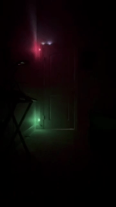
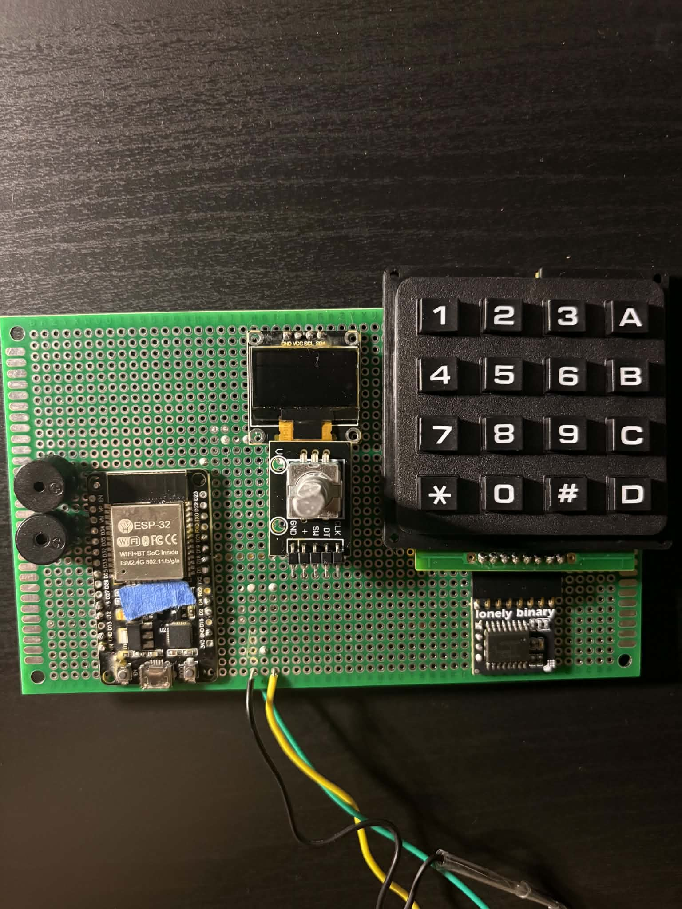
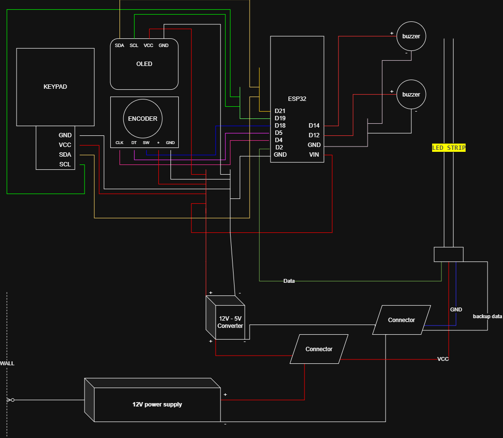

# KEYPAD-CONTROLLING LED STRIP 

> LED strip, controlled from keypad

## Demo

<!-- Add a photo, GIF, or video link of your LEDs in action -->


## Features

- 🎨 Feature 1 lights picking from keypad
- 📶 Feature 2 brightness controller from rotary
- ⚡ Feature 3 SECRET CODES

## Hardware
(you can replace these with other components of the same type.)

| Component | Qty | How to get? | For what? |
|---|---|---|---|
| ESP32-WROOM-32 | 1 | https://www.amazon.com/dp/B08D5ZD528 | controlling the whole system |
| LED Strip (WS2815) 5m 60 IP65 | 1 | https://www.aliexpress.com/p/order/index.html?spm=a2g0o.detail.headerAcount.2.3dd5ng78ng781S | main light source |
| DROK 12V to 5V Converter | 1 | https://www.amazon.com/dp/B07P663XJV | converts power for the ESP32 and other components that require a maximum of 5V |
| 12V DC power supply | 1 | https://www.amazon.com/dp/B07MZP9247 | main power supply |
| Lever wire connectors | 1 | https://www.amazon.com/dp/B09CKDWK4Q | connecting multiple wires |
| Keypad | 1 | https://www.amazon.com/dp/B0G6YRQJ5F | to enter characters and pick colors (replaceable with other keypads) |
| Rotary Encoder | 1 | various | controls brightness, turns the LED strip on/off |
| OLED screen | 1 | various | shows inputs and entered values |
| Buzzers | 1 | various | sound feedback / notifications |
| A few pieces of wire | -- | various | connecting components |

### Main Layout



### Wiring Diagram
<!-- Replace with an actual diagram image if you have one -->


### Usage video: 
https://youtube.com/shorts/V1uS2J1ty8I?feature=share

## Software Requirements

- ESP32 board flashed with standard MicroPython firmware
  (includes `neopixel`, `framebuf`, `machine` built-in)

- Libraries:
  - `ssd1306` — SSD1306 OLED driver (I2C). Already included in
    this repo as `lib/ssd1306.py`; no separate installation needed,
    just upload it to the board along with the other files.

## Installation

1. Wire up all the hardware. Connect each component to the pins below (as defined in
   the Wiring diagram):

   | Component              | ESP32 Pin |
   |-------------------------|-----------|
   | LED strip (data in)     | GPIO 2    |
   | Buzzer 1                | GPIO 14   |
   | Buzzer 2                | GPIO 12   |
   | OLED (I2C SCL)           | GPIO 19   |
   | OLED (I2C SDA)           | GPIO 21   |
   | Keypad/PCF (I2C, shares bus with OLED) | SCL: GPIO 19, SDA: GPIO 21 |
   | Rotary encoder CLK       | GPIO 4    |
   | Rotary encoder DT        | GPIO 5    |
   | Rotary encoder switch    | GPIO 18   |

   Double-check power (5V/3.3V) and ground connections for the
   LED strip and OLED before plugging the board into USB.

2. Clone this repository
```bash
   git clone https://github.com/HuyPham235711/keypad-controlling-led-strip.git
   cd keypad-controlling-led-strip

```

3. Open Thonny, then go to **Tools > Options > Interpreter**,
   select **MicroPython (ESP32)**

4. Pick the correct COM port which has your ESP32

5. Copy all files from the project onto the device. You have
   two options:

   **Option A — Manual (via Thonny)**
   Open **View > Files** in Thonny. In the top panel
   ("This computer"), navigate to the project folder. Select
   all `.py` files, right-click, and choose **Upload to /**.

   **Option B — Bulk copy (via mpremote)**
   Faster if you have many files. First install mpremote:
```bash
   pip install mpremote
```
   Then **disconnect/close Thonny's connection to the board**
   (Thonny and mpremote can't use the COM port at the same
   time), and run this from the project folder:
```bash
   python -m mpremote connect COM11 fs cp -r . :/
```
   Replace `COM11` with your board's actual port. Reconnect in
   Thonny afterward to continue.

6. Once all files are on the device, open `main.py` in Thonny and
   click **Run** (green play button) to test it, or reset the
   board — `main.py` runs automatically on boot.

## Usage

Once installation is complete, just plug the ESP32 into any USB
power source (wall adapter, power bank, etc.) — no computer or
Thonny needed. It boots automatically and runs `main.py`.

### Keypad

- **Single key (0-9, A-D)** — sets a static LED color. Press the
  key, then `*` to confirm. See `LED_COLORS` in `config.py` for
  the full color mapping.
- **Secret codes** — type a code, then press `*` to activate a
  special LED effect with a matching sound jingle:

  | Code   | Effect          |
  |--------|-----------------|
  | `C137` | RICK AND MORTY  |
  | `12C1` | Color Twinkles  |
  | `D21`  | Hellfire        |
  | `101`  | Matrix          |
  | `42`   | Cosmos          |
  | `Custom your own!!!` | ??? |

- **`#`** — deletes the last character you typed (backspace).
- The OLED screen shows what you're typing as you go.

### Rotary Encoder

- **Turn** — adjusts LED brightness (0-100%). The OLED shows the
  current brightness as you turn it.
- **Press (click)** — toggles the whole system on/off. When off,
  the LEDs turn off and the keypad/effects are disabled until you
  press it again.

## Project Structure

```
project/
├── main.py
├── config.py
├── hardware.py
├── led_control.py
├── led_effects.py
├── music.py
├── buzzer.py
├── rotary_encoder.py
├── keypad.py
├── system_control.py
└── lib/
    └── ssd1306.py
```

## Troubleshooting

| Issue | Possible Fix |
|---|---|
| LEDs don't light up at all | Check the LED strip's power and ground wires first — this is usually a power issue, not a code issue. |
| LEDs light up but don't respond to commands, or react laggy/glitchy | Check the data signal wire between the ESP32 (GPIO 2) and the LED strip. A loose or noisy signal wire causes this even when power is fine. |
| Screen freezes and the buzzer plays one long continuous beep | This usually means the software crashed trying to find a connected device (e.g. OLED or keypad not detected on I2C). Unplug and replug power, and double-check the I2C wiring (SCL/SDA) to the OLED and keypad. |
| Rotary encoder doesn't work | Brightness control is disabled while a secret effect is running. This is intentional and is not a malfunction. |

## License

This project is licensed under the MIT License — see the [LICENSE](LICENSE) file for details.

## Acknowledgments

- Libraries and tutorials that helped you build this

